# Cybersecurity Refresher

## Core Security Principles

### The CIA Triad

The foundation of information security rests on three fundamental pillars:


#### 🔒 Confidentiality
**Purpose**: Safeguarding sensitive information from unauthorized disclosure

**Primary Implementation**: Encryption
- **Symmetric Encryption**
  - Single key for encryption and decryption
  - High computational efficiency
  - Ideal for large-scale data protection
  - Faster processing compared to asymmetric methods

- **Asymmetric Encryption**
  - Public-private key pair system
  - Enables secure communication without shared secrets
  - Foundation for digital signatures and PKI

#### 🛡️ Integrity
**Purpose**: Ensuring data remains unmodified and trustworthy

**Primary Implementation**: Cryptographic Hashing

| Hash Algorithm | Security Level | Speed | Use Case |
|----------------|---------------|-------|----------|
| MD5 | ❌ Weak | Fast | Legacy systems only |
| SHA-1 | ⚠️ Deprecated | Moderate | Avoid for new implementations |
| SHA-256 | ✅ Strong | Moderate | Recommended standard |
| SHA-512 | ✅ Very Strong | Slower | High-security requirements |

> **Best Practice**: Use SHA-256 or SHA-512 to prevent hash collision attacks

#### ⚡ Availability
**Purpose**: Maintaining reliable system access and uptime

**Common Implementations**:
- Data backups and disaster recovery
- Network redundancy and failover systems
- Load balancing for traffic distribution

---

## The AAA Framework

Authentication, Authorization, and Accounting form the access control trinity:

```
User Request → Authentication → Authorization → Access Granted → Accounting
     │              │              │              │              │
     │         Who are you?    What can you do?   System Access   Activity Logs
     │              │              │              │              │
 Login Attempt   Verify Identity  Check Permissions  Resource Use  Audit Trail
```

### 🔑 Authentication
**Definition**: Identity verification process

**Methods**: Passwords, biometrics, security tokens, multi-factor authentication

### 📋 Authorization
**Definition**: Permission assignment based on verified identity

**Timing**: Always occurs after successful authentication

**Basis**: Role-based access control (RBAC) and permission matrices

### 📊 Accounting
**Definition**: Activity monitoring and logging for accountability

**Purpose**: Audit trails, compliance reporting, and incident investigation

---

## Risk Assessment Framework: VTR Model

Understanding the relationship between vulnerabilities, threats, and risks:

```mermaid
flowchart LR
    V[Vulnerabilities<br/>System Weaknesses] 
    T[Threats<br/>Potential Dangers]
    R[Risks<br/>Impact × Likelihood]
    
    V -->|Can be exploited by| T
    T -->|May exploit| V
    V & T -->|Combined create| R
```



### 🔓 Vulnerabilities
System weaknesses or security gaps that could be exploited
> **Analogy**: An unlocked door or broken window in your home

### ⚠️ Threats
Potential dangers seeking to exploit existing vulnerabilities
> **Analogy**: Burglars looking for opportunities to break into homes

### 📈 Risks
Calculated probability that threats will successfully exploit vulnerabilities
> **Formula**: Risk = Threat Likelihood × Vulnerability Impact

---

## Incident Classification System

### Security Events vs. Incidents

| Term | Definition | CIA Impact |
|------|------------|------------|
| **Event** | Suspicious activity that *may* compromise security | Potential impact |
| **Incident** | Confirmed security breach with actual impact | Confirmed compromise |

### Alert Classification Matrix

Understanding detection accuracy is crucial for SOC operations:

```
                    ACTUAL THREAT STATUS
                 Threat Present    No Threat
DETECTION    +  │ True Positive  │ False Positive │
RESULT       -  │ False Negative │ True Negative  │
```

- **✅ True Positive**: Correctly identified genuine threat
- **✅ True Negative**: Correctly dismissed benign activity  
- **❌ False Positive**: Incorrectly flagged harmless event (alert fatigue)
- **❌ False Negative**: Missed actual threat (security gap)

---

## Threat Actor Landscape

### Actor Categories by Motivation


### 🎯 Advanced Persistent Threats (APTs)
- **Characteristics**: Well-funded, persistent, organized
- **Capabilities**: Advanced tools, long-term campaigns
- **Motivation**: Espionage, state-sponsored activities

### 🗣️ Hacktivists
- **Motivation**: Social, political, or environmental causes
- **Methods**: Website defacements, DDoS attacks, data leaks
- **Examples**: Anonymous, environmental protest groups

### 💰 Cybercriminals
- **Primary Goal**: Financial or material gain
- **Operations**: Ransomware, fraud, identity theft
- **Structure**: Organized criminal enterprises

### 🏢 Insider Threats
- **Risk Factor**: Legitimate system access
- **Motivations**: Financial gain, revenge, coercion
- **Impact**: Often most damaging due to trusted access

---

## Common Attack Vectors

### Primary Threat Categories

| Threat Type | Description | Primary Target |
|-------------|-------------|----------------|
| **Malware** | Malicious software designed to infiltrate and harm systems | System Integrity |
| **Phishing** | Social engineering to steal credentials and sensitive data | User Credentials |
| **DoS/DDoS** | Service disruption through resource exhaustion | System Availability |
| **Zero-Day** | Exploits targeting unknown vulnerabilities | Unpatched Systems |
| **Password Attacks** | Credential compromise through various methods | Authentication Systems |
| **Supply Chain** | Compromise through trusted third-party components | Vendor Dependencies |
| **Identity Theft** | Personal information theft for impersonation | Personal Data |

---

## Threat Intelligence Terminology

### Key Indicators and Patterns

#### 🚨 Indicators of Compromise (IOCs)
**Definition**: Digital forensic artifacts suggesting system compromise
**Examples**: Malicious file hashes, suspicious IP addresses, unusual network traffic

#### 🔍 Indicators of Attack (IOAs)  
**Definition**: Real-time signs of ongoing attack activities
**Examples**: Unusual login patterns, privilege escalation attempts, lateral movement

#### 📋 Tactics, Techniques, and Procedures (TTPs)
**Definition**: Behavioral patterns and methodologies used by threat actors
**Purpose**: Understanding adversary capabilities and predicting future attacks


---

## Summary

This cybersecurity refresher establishes the fundamental concepts essential for SOC analysts:

- **CIA Triad**: The cornerstone of information security
- **AAA Framework**: Access control methodology
- **VTR Model**: Risk assessment approach
- **Classification Systems**: Accurate threat identification
- **Threat Landscape**: Understanding adversary motivations
- **Attack Vectors**: Common compromise methods
- **Intelligence Terms**: Threat hunting and analysis terminology

These concepts form the foundation for effective security monitoring, incident response, and threat analysis in a Security Operations Center environment.

[⬆️ Back to Refreshers](./README.md)
