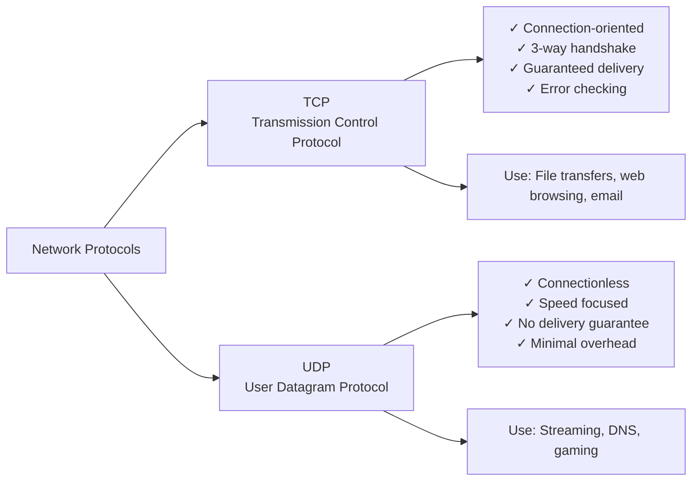
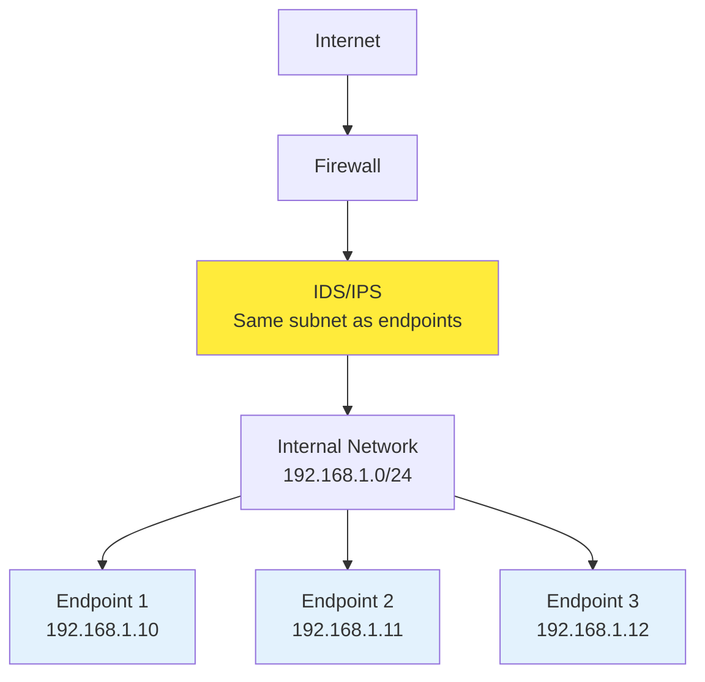

# Networking Refresher

## Hardware Addressing

### 🔗 MAC Addresses (Media Access Control)

**Layer 2 - Data Link Layer**

MAC addresses serve as the fundamental hardware identification system for network devices.

```
MAC Address Structure: XX:XX:XX:XX:XX:XX (48 bits / 6 bytes)
                      └─────┘ └─────┘
                        OUI    Device
                   (First 3 bytes) (Last 3 bytes)
```

#### Key Characteristics:
- **Physical Address**: Permanently assigned to network interface hardware
- **Organizational Unique Identifier (OUI)**: First 3 bytes identify the manufacturer
- **Device Identifier**: Last 3 bytes provide unique device identification
- **Permanence**: Burned into hardware but can be spoofed via software

> **SOC Analyst Note**: MAC address spoofing is a common technique used by attackers to evade network access controls and blend in with legitimate traffic.

---

## Logical Addressing

### 🌐 IP Addresses (Internet Protocol)

**Layer 3 - Network Layer**

IP addresses provide logical addressing for network communication, operating above the physical hardware layer.

#### Version Comparison:

| Aspect | IPv4 | IPv6 |
|--------|------|------|
| **Address Length** | 32 bits (4 octets) | 128 bits (8 groups) |
| **Format** | 192.168.1.1 | 2001:0db8:85a3::8a2e:0370:7334 |
| **Address Space** | ~4.3 billion addresses | ~340 undecillion addresses |
| **Usage** | Primary internet protocol | Growing adoption |

#### IP Address Components:
```
IP Address = Network Portion + Host Portion
Example: 192.168.1.100/24
         └─────────┘ └─┘
         Network    Host
```

---

## Network Segmentation

### 📊 Subnetting Fundamentals

Subnetting divides larger networks into smaller, manageable segments using CIDR (Classless Inter-Domain Routing) notation.

**CIDR Notation Examples:**
- `/24` = 255.255.255.0 (254 usable hosts)
- `/16` = 255.255.0.0 (65,534 usable hosts)
- `/8` = 255.0.0.0 (16,777,214 usable hosts)

---

## Network Classifications

### 🏢 IP Address Classes and Private Networks

#### Traditional Class System:

| Class | First Octet Range | Default Subnet Mask | CIDR | Approximate Hosts | Network Size |
|-------|-------------------|---------------------|------|-------------------|--------------|
| **Class A** | 1-126 | 255.0.0.0 | /8 | ~16 Million | Large Networks |
| **Class B** | 128-191 | 255.255.0.0 | /16 | ~65 Thousand | Medium Networks |
| **Class C** | 192-223 | 255.255.255.0 | /24 | 254 | Small Networks |

#### Private vs Public IP Ranges:

| Network Class | Private Range | CIDR | Typical Use |
|---------------|---------------|------|-------------|
| **Class A** | 10.0.0.0 - 10.255.255.255 | /8 | Large enterprises |
| **Class B** | 172.16.0.0 - 172.31.255.255 | /12 | Medium organizations |
| **Class C** | 192.168.0.0 - 192.168.255.255 | /16 | Home/small office |

> **Security Implication**: Private IP addresses are not routable on the internet, providing natural network segmentation and requiring NAT for external communication.

---

## Communication Protocols

### 🚪 Ports and Services

**Port Range Classification:**
- **0-1023**: Well-known/system ports (require admin privileges)
- **1024-49151**: Registered ports (applications and services)
- **49152-65535**: Dynamic/private ports (client connections)

#### Protocol Comparison:



### 📋 Critical Ports for SOC Analysts

| Port | Protocol | Service | Security Notes |
|------|----------|---------|----------------|
| **20/21** | TCP | FTP | Unencrypted file transfer |
| **22** | TCP | SSH | Secure remote access |
| **23** | TCP | Telnet | ❌ Unencrypted remote access |
| **25** | TCP | SMTP | Email transmission |
| **53** | TCP/UDP | DNS | Name resolution |
| **80** | TCP | HTTP | ❌ Unencrypted web traffic |
| **88** | TCP/UDP | Kerberos | Authentication protocol |
| **110** | TCP | POP3 | Email retrieval |
| **123** | UDP | NTP | Time synchronization |
| **137** | UDP | NetBIOS | Windows networking |
| **143** | TCP | IMAP | Email access |
| **161** | UDP | SNMP | Network management |
| **389** | TCP | LDAP | Directory services |
| **443** | TCP | HTTPS | ✅ Encrypted web traffic |
| **445** | TCP | SMB | Windows file sharing |
| **500** | UDP | IKE | VPN key exchange |
| **514** | UDP | Syslog | Log transmission |
| **636** | TCP | LDAPS | ✅ Secure LDAP |
| **993** | TCP | IMAPS | ✅ Secure IMAP |
| **995** | TCP | POP3S | ✅ Secure POP3 |
| **3389** | TCP | RDP | Windows remote desktop |

> **SOC Alert**: Monitor unusual traffic on well-known ports and be especially vigilant for services running on non-standard ports.

---

## Network Protocol Stack

### 📚 OSI Model vs TCP/IP Implementation

Understanding how data flows through network layers is crucial for traffic analysis and incident investigation.

#### **OSI Model (7 Layers)**

| Layer | Name | Function | Examples | Data Unit |
|-------|------|----------|----------|-----------|
| **7** | **Application** | User interface & network processes | HTTP, FTP, SMTP, DNS | Data |
| **6** | **Presentation** | Data encryption, compression, translation | SSL/TLS, JPEG, ASCII | Data |
| **5** | **Session** | Session establishment & management | NetBIOS, RPC, SQL sessions | Data |
| **4** | **Transport** | End-to-end communication & reliability | TCP, UDP | Segments |
| **3** | **Network** | Routing & logical addressing | IP, ICMP, OSPF | Packets |
| **2** | **Data Link** | Frame formatting & error detection | Ethernet, WiFi, PPP | Frames |
| **1** | **Physical** | Physical transmission of raw bits | Cables, fiber, radio waves | Bits |

#### **TCP/IP Model (4 Layers)**

| TCP/IP Layer | Equivalent OSI Layers | Primary Protocols | Purpose |
|--------------|----------------------|-------------------|---------|
| **Application** | Layers 5-7 | HTTP, SMTP, FTP, DNS | User applications and services |
| **Transport** | Layer 4 | TCP, UDP | End-to-end communication |
| **Internet** | Layer 3 | IP, ICMP, ARP | Packet routing and addressing |
| **Network Access** | Layers 1-2 | Ethernet, WiFi | Physical network access |

#### **Practical 5-Layer Model (Most Common)**

| Layer | Name | Data Unit | Key Function | Security Focus |
|-------|------|-----------|--------------|---------------|
| **5** | **Application** | Data | User interface & application payload | Application-layer attacks |
| **4** | **Transport** | Segments | Port-based services and reliability | Port scanning, service enum |
| **3** | **Network** | Packets | IP routing and addressing | IP spoofing, routing attacks |
| **2** | **Data Link** | Frames | MAC addressing and switching | ARP poisoning, MAC flooding |
| **1** | **Physical** | Bits | Physical signal transmission | Physical access, cable tapping |

#### Data Encapsulation Process:

| Layer | Data Unit | Header Added | Example |
|-------|-----------|--------------|---------|
| **Application** | Data | Application headers | HTTP request |
| **Transport** | Segments | TCP/UDP headers | Port numbers |
| **Network** | Packets | IP headers | Source/destination IPs |
| **Data Link** | Frames | Ethernet headers | MAC addresses |
| **Physical** | Bits | Physical encoding | Electrical signals |

---

## Network Security Architecture

### 🛡️ IDS/IPS Placement Strategy

**Optimal Positioning Principle**: Deploy intrusion detection and prevention systems where they share the same network segment as monitored endpoints.



#### Benefits of Proper IDS/IPS Placement:
- **Visibility**: Monitor all traffic to/from critical assets
- **Context**: Same source IP visibility enables rapid asset identification
- **Response**: Faster incident response and threat containment
- **Coverage**: Comprehensive monitoring of lateral movement attempts

---

## SOC Analyst Applications

### 🔍 Network Traffic Analysis

Understanding these networking fundamentals enables SOC analysts to:

#### **Layer 2 Analysis**:
- Identify MAC address spoofing attempts
- Detect unauthorized devices on network segments
- Analyze ARP poisoning attacks

#### **Layer 3 Analysis**:
- Track IP address reputation and geolocation
- Identify unusual routing patterns
- Monitor for IP address conflicts and scanning

#### **Layer 4 Analysis**:
- Correlate service ports with expected applications
- Detect port scanning and service enumeration
- Identify covert channels and tunneling attempts

#### **Traffic Flow Monitoring**:
- Establish network baseline behavior
- Detect lateral movement patterns
- Identify data exfiltration attempts

---

## Summary

This networking refresher provides the foundational knowledge necessary for effective SOC operations:

- **Hardware Addressing**: MAC addresses for device identification
- **Logical Addressing**: IP addressing and subnetting concepts
- **Protocol Understanding**: TCP/UDP characteristics and common ports
- **Network Architecture**: Protocol stack layers and data flow
- **Security Positioning**: Strategic placement of monitoring tools

These concepts form the backbone of network traffic analysis, enabling SOC analysts to identify anomalies, investigate incidents, and respond to security threats effectively.

[⬆️ Back to Refreshers](./README.md)
