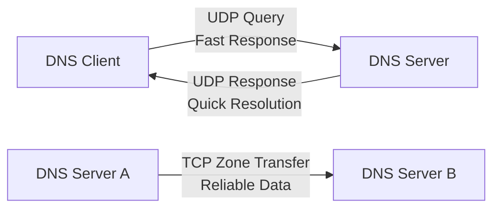
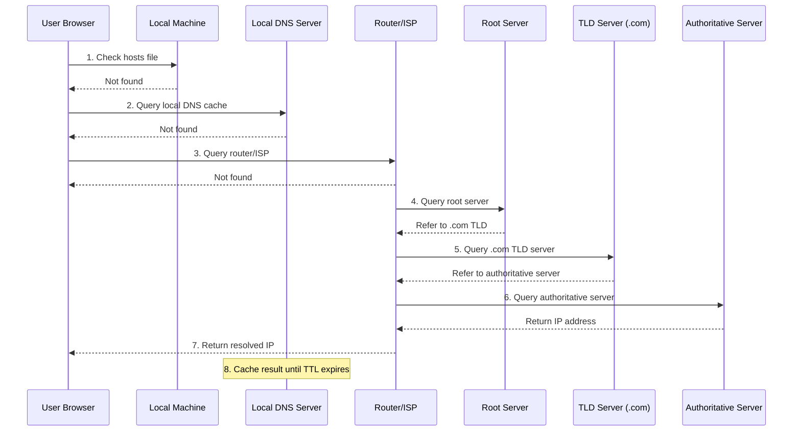
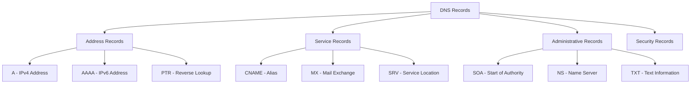

# DNS Refresher

## Domain Name System Fundamentals

### 🌐 Purpose and Function

The Domain Name System (DNS) serves as the internet's phonebook, translating human-readable domain names into machine-readable IP addresses that enable network communication.

```
Human Request: "Take me to google.com"
DNS Translation: google.com → 142.250.191.14
Result: Browser connects to Google's servers
```

---

## Protocol Architecture

### 📡 DNS Communication Protocols

DNS operates on both TCP and UDP protocols, each serving specific purposes:

| Protocol | Port | Primary Use | Characteristics |
|----------|------|-------------|-----------------|
| **UDP** | 53 | Standard queries | Fast, lightweight, most common |
| **TCP** | 53 | Zone transfers | Reliable, for large data transfers |



> **SOC Insight**: Monitor for unusual TCP DNS traffic, as it may indicate zone transfer attempts or DNS tunneling attacks.

---

## DNS Resolution Process

### 🔍 Step-by-Step Domain Resolution

Understanding the DNS resolution hierarchy is crucial for identifying attack vectors and troubleshooting network issues.



#### Resolution Hierarchy Breakdown:

1. **Local Hosts File**: Manual IP-to-domain mappings on local machine
2. **Local DNS Cache**: Recently resolved domains stored temporarily
3. **Router/ISP DNS**: First external DNS resolver
4. **Root Servers**: 13 global servers directing to TLD servers
5. **TLD Servers**: Top-level domain authorities (.com, .org, .net)
6. **Authoritative Servers**: Definitive source for domain information
7. **Caching**: Store results locally until Time-To-Live (TTL) expires

---

## Domain Structure Hierarchy

### 🏗️ Domain Name Components

Understanding domain structure helps identify legitimate vs. suspicious domains:

```
Full Domain Structure: www.google.com.
                       │    │     │  │
                   Subdomain │     │  │
                        2nd Level   │  │
                            Top Level  │
                                  Root
```

#### Component Breakdown:

| Component | Example | Purpose | Security Notes |
|-----------|---------|---------|----------------|
| **Root Domain** | `.` | Internet's top level | Usually implicit |
| **Top Level Domain (TLD)** | `.com` | Domain category | Monitor suspicious TLDs |
| **Second Level Domain** | `google` | Organization identifier | Primary brand indicator |
| **Subdomain** | `www` | Service/department | Often used in attacks |

> **Threat Detection**: Attackers often use similar-looking subdomains or TLDs to create deceptive domains (e.g., `www.g00gle.com`).

---

## DNS Record Types

### 📋 Essential DNS Records for SOC Analysts

DNS records contain various types of information beyond simple IP address mapping:



#### Record Type Reference:

| Record | Full Name | Purpose | Example | Security Relevance |
|--------|-----------|---------|---------|-------------------|
| **A** | Address | IPv4 address mapping | `example.com → 192.168.1.1` | Primary attack target |
| **AAAA** | IPv6 Address | IPv6 address mapping | `example.com → 2001:db8::1` | IPv6 security monitoring |
| **CNAME** | Canonical Name | Domain aliasing | `www.example.com → example.com` | Redirect chain analysis |
| **MX** | Mail Exchange | Email server location | `mail.example.com priority 10` | Email security routing |
| **SOA** | Start of Authority | Zone information | Contains admin details | Zone transfer security |
| **NS** | Name Server | Authoritative server | `ns1.example.com` | DNS infrastructure mapping |
| **SRV** | Service | Service + port mapping | `_http._tcp.example.com` | Service enumeration |
| **PTR** | Pointer | Reverse DNS lookup | `1.1.168.192.in-addr.arpa` | IP reputation checking |
| **TXT** | Text | Miscellaneous data | SPF, DKIM, verification | Often contains security policies |

---

## DNS Security Implications

### 🛡️ Common DNS-Based Attacks

Understanding DNS vulnerabilities helps SOC analysts identify potential threats:

#### **DNS Spoofing/Poisoning**
- **Method**: Inject false DNS responses
- **Impact**: Redirect users to malicious sites
- **Detection**: Monitor for inconsistent DNS responses

#### **DNS Tunneling**
- **Method**: Encode data within DNS queries
- **Impact**: Data exfiltration, C2 communication
- **Detection**: Look for unusual DNS query patterns and sizes

#### **Domain Generation Algorithms (DGA)**
- **Method**: Algorithmically generate domain names
- **Impact**: Dynamic C2 infrastructure
- **Detection**: Monitor for random-looking domain queries

#### **DNS Amplification Attacks**
- **Method**: Use DNS servers to amplify DDoS traffic
- **Impact**: Service disruption
- **Detection**: Large volume of DNS responses to single IP

---

## Monitoring and Analysis

### 🔍 DNS Traffic Analysis for SOC

#### **Normal DNS Patterns**:
- Queries to well-known domains
- Reasonable TTL values
- Standard record types
- Consistent response times

#### **Suspicious DNS Indicators**:

| Indicator | Description | Investigation Priority |
|-----------|-------------|----------------------|
| **High Query Volume** | Unusual number of requests | Medium |
| **Random Domain Names** | DGA-generated domains | High |
| **Large TXT Records** | Potential data exfiltration | High |
| **Uncommon TLDs** | Suspicious domain extensions | Medium |
| **Subdomain Abuse** | Excessive subdomain creation | Medium |
| **Failed Resolutions** | Multiple NXDOMAIN responses | Low-Medium |

#### **DNS Monitoring Tools Integration**:
```
DNS Logs → SIEM Analysis → Alert Generation → Incident Response
    ↓
Pattern Recognition:
- Baseline normal behavior
- Identify anomalies
- Correlate with threat intelligence
- Generate actionable alerts
```

---

## Practical SOC Applications

### 🎯 DNS Investigation Techniques

#### **Domain Reputation Analysis**:
1. Check domain age and registration details
2. Analyze DNS record history
3. Correlate with threat intelligence feeds
4. Examine certificate transparency logs

#### **Infrastructure Mapping**:
1. Enumerate DNS records for target domains
2. Identify hosting providers and CDNs
3. Map network infrastructure relationships
4. Track DNS changes over time

#### **Incident Response Support**:
1. Identify compromised domains in traffic
2. Block malicious DNS resolutions
3. Analyze attack infrastructure
4. Support takedown coordination

---

## DNS Security Best Practices

### 🔒 Protective Measures

#### **For Organizations**:
- Implement DNS filtering and monitoring
- Use secure DNS resolvers (DNS over HTTPS/TLS)
- Monitor for DNS tunnel activity
- Maintain DNS logs for forensic analysis

#### **For SOC Analysts**:
- Establish DNS traffic baselines
- Monitor for DNS-based IOCs
- Correlate DNS data with other security events
- Investigate unusual query patterns

---

## Summary

DNS serves as a critical component of internet infrastructure and a frequent attack vector. Key takeaways for SOC analysts:

- **Resolution Process**: Understanding the hierarchical lookup process helps identify attack points
- **Record Types**: Different DNS records serve various functions and have unique security implications
- **Attack Vectors**: DNS can be exploited for redirection, tunneling, and amplification attacks
- **Monitoring**: Effective DNS monitoring requires baseline establishment and anomaly detection
- **Investigation**: DNS data provides valuable intelligence for incident response and threat hunting

Mastering DNS fundamentals enables SOC analysts to detect sophisticated attacks, investigate incidents effectively, and protect organizational infrastructure from DNS-based threats.

[⬆️ Back to Refreshers](./README.md)
