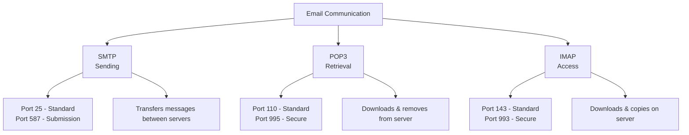
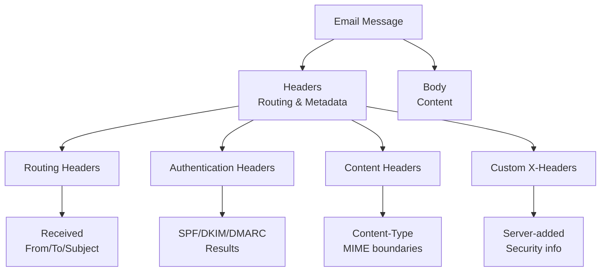
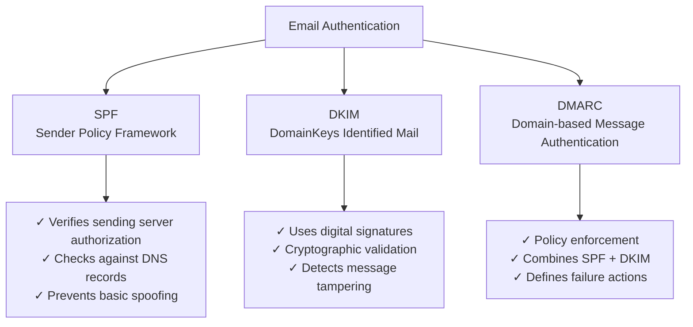

# Email Security Refresher

## Email Protocol Fundamentals

### 📧 Core Email Protocols

Understanding email protocols is essential for analyzing email-based attacks and investigating security incidents.



#### Protocol Comparison:

| Protocol | Purpose | Ports | Message Handling | Security Implications |
|----------|---------|-------|------------------|----------------------|
| **SMTP** | Mail transmission | 25, 587 | Server-to-server delivery | Primary attack vector for spoofing |
| **POP3** | Mail retrieval | 110, 995 | Download and delete | Limited forensic evidence |
| **IMAP** | Mail access | 143, 993 | Synchronized access | Better audit trail preservation |

> **SOC Insight**: IMAP's message retention makes it superior for forensic investigations, while POP3's download-and-delete behavior can hinder incident analysis.

---

## Email Transaction Logging

### 📊 Mail Server Logs

Mail servers generate comprehensive transaction logs that provide crucial forensic evidence for security investigations.

#### **Log Generation Sources**:
- **Mail Transfer Agents (MTAs)**: SMTP server logs
- **Mail Delivery Agents (MDAs)**: Local delivery logs  
- **Mail User Agents (MUAs)**: Client access logs
- **Security Gateways**: Anti-spam and anti-malware logs

#### **Forensic Value vs. Reliability**:
```
High Forensic Value ←→ Spoofing Risk
Transaction Logs provide detailed routing information
BUT some fields can be manipulated by attackers
```

---

## Transaction Log Analysis

### 🔍 Key Transaction Fields

Critical fields for SOC analysts investigating email-based incidents:

| Field | Description | Forensic Value | Spoofing Risk |
|-------|-------------|----------------|---------------|
| **Date-Time** | UTC timestamp of event | ✅ High | ❌ Low |
| **Original Client-IP** | Source IP address | ✅ Very High | ⚠️ Medium |
| **Sender** | From/Sender header address | ✅ High | ⚠️ High |
| **Recipient** | Destination addresses | ✅ High | ❌ Low |
| **Return-Path** | Bounce address | ✅ Medium | ⚠️ High |
| **Message-ID** | Unique message identifier | ✅ High | ⚠️ Medium |
| **Subject** | Email subject line | ✅ Medium | ⚠️ High |
| **Total-Bytes** | Message size including attachments | ✅ Medium | ❌ Low |

#### **Investigation Priority Matrix**:
```
High Priority Fields (Low Spoofing Risk):
├── Date-Time stamps
├── Server-generated IPs  
├── Message size metrics
└── Recipient addresses

Medium Priority Fields (Verify Against Multiple Sources):
├── Message-ID patterns
├── Return-Path analysis
└── Original Client-IP correlation

High Verification Fields (High Spoofing Risk):
├── Sender addresses
├── Subject lines
└── Custom headers
```

---

## Message Header Analysis

### 📋 Email Header Structure

Email headers contain routing information and metadata essential for forensic analysis and threat detection.



#### **Critical Header Fields for Analysis**:

| Header Field | Purpose | Security Relevance | Spoofing Potential |
|--------------|---------|-------------------|-------------------|
| **Received** | Mail server routing path | ✅ High - Shows message journey | ⚠️ Difficult to spoof completely |
| **Authentication-Results** | SPF/DKIM/DMARC validation | ✅ Very High - Security validation | ❌ Server-generated |
| **Reply-To** | Response destination | ⚠️ Medium - Potential redirection | ⚠️ High - Easily spoofed |
| **From** | Apparent sender | ✅ High - User perception | ⚠️ High - Primary spoof target |
| **To** | Recipients | ✅ Medium - Target identification | ❌ Low - Delivery requirement |
| **Subject** | Message topic | ⚠️ Medium - Social engineering | ⚠️ High - Easily spoofed |
| **Return-Path** | Bounce address | ✅ High - True sender indicator | ⚠️ Medium - Can be manipulated |
| **Content-Type** | Content format | ✅ Medium - Malware detection | ⚠️ Low - Technical requirement |
| **Message-ID** | Unique identifier | ✅ High - Tracking/correlation | ⚠️ Medium - Pattern analysis |
| **X-Headers** | Custom metadata | ✅ High - Security intel | ❌ Server-controlled |

---

## Email Authentication Mechanisms

### 🔐 SPF, DKIM, and DMARC

Modern email security relies on three complementary authentication protocols:



#### **Authentication Protocol Details**:

### 🛡️ SPF (Sender Policy Framework)
**Function**: Validates that email originates from authorized mail servers

**Mechanism**:
- DNS TXT record lists authorized sending IPs
- Receiving server checks sender IP against SPF record
- Results: Pass, Fail, SoftFail, Neutral, TempError, PermError

**Example SPF Record**:
```
v=spf1 include:_spf.google.com ip4:192.168.1.0/24 -all
```

### 🔑 DKIM (DomainKeys Identified Mail)  
**Function**: Cryptographically signs email messages to prevent tampering

**Mechanism**:
- Private key signs message headers and body
- Public key published in DNS for verification
- Signature validates message integrity and authenticity

**Security Benefits**:
- Detects message modification in transit
- Provides non-repudiation
- Resistant to replay attacks

### 📜 DMARC (Domain-based Message Authentication)
**Function**: Provides policy framework for SPF and DKIM failure handling

**Policy Actions**:
- **None**: Monitor only, no action
- **Quarantine**: Mark as suspicious, move to spam
- **Reject**: Block message delivery entirely

**Reporting**: Generates aggregate and forensic reports for domain owners

---

## Authentication Result Analysis

### 🔍 Interpreting Authentication Headers

SOC analysts must understand authentication results to identify spoofing attempts and validate email legitimacy.

#### **Authentication Result Examples**:

```
Authentication-Results: mx.example.com;
    spf=pass smtp.mailfrom=legitimate.com;
    dkim=pass header.d=legitimate.com;
    dmarc=pass header.from=legitimate.com
```
✅ **Legitimate Email**: All authentication checks passed

```
Authentication-Results: mx.example.com;
    spf=fail smtp.mailfrom=suspicious.com;
    dkim=none header.d=suspicious.com;
    dmarc=fail header.from=trusted-bank.com
```
❌ **Spoofing Attempt**: Authentication failures indicate potential fraud

#### **Result Interpretation Matrix**:

| SPF | DKIM | DMARC | Assessment | Investigation Priority |
|-----|------|-------|------------|----------------------|
| ✅ Pass | ✅ Pass | ✅ Pass | Legitimate | Low |
| ✅ Pass | ❌ Fail | ⚠️ Quarantine | Suspicious | Medium |
| ❌ Fail | ❌ None | ❌ Reject | High Risk | High |
| ⚠️ SoftFail | ✅ Pass | ⚠️ Quarantine | Investigate | Medium |

---

## SOC Investigation Workflow

### 🎯 Email Forensics Process

#### **Phase 1: Initial Triage**
1. **Extract key headers** from suspicious emails
2. **Verify authentication results** (SPF/DKIM/DMARC)
3. **Analyze sender reputation** and domain age
4. **Check message routing path** via Received headers

#### **Phase 2: Deep Analysis**
1. **Correlate with threat intelligence** feeds
2. **Examine attachment hashes** and URLs
3. **Analyze writing patterns** and language indicators
4. **Cross-reference with similar incidents**

#### **Phase 3: Impact Assessment**
1. **Identify affected recipients**
2. **Check for successful delivery**
3. **Assess potential compromise**
4. **Document findings and IOCs**

---

## Common Attack Patterns

### ⚠️ Email-Based Threats for SOC Monitoring

#### **Spoofing Indicators**:
- Authentication failures (SPF/DKIM/DMARC)
- Mismatched From and Return-Path domains
- Suspicious Received header chains
- Non-standard Message-ID formats

#### **Phishing Detection**:
- Domain typosquatting in sender addresses
- Urgent or threatening subject lines
- Suspicious attachment types and sizes
- Shortened or suspicious URLs in content

#### **Business Email Compromise (BEC)**:
- Executive impersonation attempts
- Invoice/payment redirection requests
- Last-minute changes to financial transactions
- Requests bypassing normal approval processes

---

## Summary

Email security analysis requires understanding both technical protocols and authentication mechanisms:

- **Protocol Knowledge**: SMTP, POP3, and IMAP serve different functions with unique security implications
- **Log Analysis**: Transaction logs provide forensic evidence, but some fields are spoofable
- **Header Analysis**: Message headers contain routing and authentication information crucial for investigations
- **Authentication**: SPF, DKIM, and DMARC work together to validate email legitimacy
- **Investigation**: Systematic analysis of headers and authentication results enables threat detection

Mastering email security fundamentals enables SOC analysts to identify sophisticated phishing campaigns, investigate email-based attacks, and protect organizations from increasingly sophisticated email threats.

[⬆️ Back to Refreshers](./README.md)
