# Active Directory & Kerberos Refresher

## Kerberos Authentication Protocol

### 🎫 Overview and Purpose

Kerberos serves as the cornerstone authentication protocol for Active Directory environments, providing secure identity verification through a ticket-based system that eliminates the need to transmit passwords across the network.

**Core Principle**: "Never trust, always verify" - Each access request requires cryptographic proof of identity

---

## Kerberos Architecture Components

### 🏛️ Key Distribution Center (KDC)

The KDC operates as the trusted third party in Kerberos authentication, consisting of two primary services:

```mermaid
graph TD
    A[Key Distribution Center - KDC] --> B[Authentication Service - AS]
    A --> C[Ticket Granting Service - TGS]
    
    B --> B1[✓ Initial user authentication<br/>✓ Issues Ticket Granting Tickets<br/>✓ Validates user credentials]
    
    C --> C1[✓ Service ticket generation<br/>✓ Resource access authorization<br/>✓ Permission validation]
    
    style A fill:#e3f2fd
    style B fill:#f3e5f5
    style C fill:#e8f5e8
```

#### **Component Functions**:

| Service | Port | Primary Function | Security Role |
|---------|------|------------------|---------------|
| **Authentication Service (AS)** | 88 | Initial user authentication | Issues TGTs after credential validation |
| **Ticket Granting Service (TGS)** | 88 | Service access authorization | Issues service tickets for resource access |

---

## Kerberos Authentication Workflow

### 🔄 Six-Step Authentication Process

Understanding this workflow is crucial for identifying authentication anomalies and potential attacks:

#### **Detailed Step Analysis**:

**Step 1: Initial Authentication**
- User provides credentials (username/password)
- System creates encrypted authenticator
- **Security Note**: Credentials never transmitted in plaintext

**Step 2: TGT Issuance**
- KDC validates user credentials against AD database
- Issues Ticket Granting Ticket (TGT) with session key
- **Lifetime**: Typically 10 hours (configurable)

**Step 3: Service Request**
- User presents TGT to request service access
- TGT proves prior authentication to KDC
- **Security Benefit**: No re-authentication required

**Step 4: Service Ticket Generation**
- KDC validates TGT and user permissions
- Issues service-specific ticket (TGS)
- **Contains**: User identity, service permissions, expiration

**Step 5: Service Access Attempt**
- User presents service ticket to target resource
- Ticket contains encrypted authorization data
- **Validation**: Service uses its secret key to decrypt

**Step 6: Access Decision**
- Service validates ticket authenticity
- Grants access based on user permissions
- **Audit**: Access attempt logged for monitoring

---

## Active Directory Domain Services (AD DS)

### 🏢 Enterprise Directory Infrastructure

AD DS provides the foundational directory services that enable Kerberos authentication and centralized resource management.

#### **Core Capabilities**:

#### **Domain Controller Promotion Process**:
1. **Server Preparation**: Install AD DS role on Windows Server
2. **Promotion**: Execute `dcpromo` or PowerShell cmdlets
3. **Forest/Domain Creation**: Establish new forest or join existing
4. **DNS Integration**: Configure DNS services for domain resolution
5. **Replication Setup**: Establish replication with other DCs

---

## Active Directory Terminology

### 📚 Essential AD Concepts for SOC Analysts

Understanding AD terminology is crucial for investigating authentication-related incidents:

| Term | Definition | Security Relevance |
|------|------------|-------------------|
| **Domain** | Logical collection of AD objects with shared security policies | Security boundary for policies and access |
| **Object** | Individual entities (users, computers, groups) stored in AD | Attack targets and privilege escalation paths |
| **Group Policy Object (GPO)** | Collection of policy settings applied to users/computers | Common target for persistence and privilege escalation |
| **Organizational Unit (OU)** | Logical container for organizing AD objects | Delegation boundary and administrative scope |
| **Domain Controller (DC)** | Server hosting AD database and providing authentication | Critical infrastructure component and high-value target |
| **Domain Computer** | Machine joined to the AD domain | Potential attack vector and lateral movement target |
| **Schema** | Definition of object types and attributes in AD | Determines what objects can exist and their properties |
| **LDAP** | Protocol for accessing directory information | Common reconnaissance and enumeration vector |
| **Forest** | Collection of domains sharing schema and configuration | Trust boundary and administrative scope |

---

## AD Forest and Domain Structure

### 🌳 Hierarchical Organization

#### **Security Boundaries**:
- **Forest**: Ultimate security boundary - complete trust within forest
- **Domain**: Administrative boundary - trust relationships configurable
- **OU**: Delegation boundary - granular administrative control

---

## Kerberos Security Implications

### 🔒 Attack Vectors and Monitoring

SOC analysts must understand common Kerberos-based attacks:

#### **Common Kerberos Attacks**:

| Attack Type | Description | Detection Method |
|-------------|-------------|------------------|
| **Golden Ticket** | Forged TGT using KRBTGT hash | Monitor for unusual TGT properties and lifetime |
| **Silver Ticket** | Forged service ticket using service account hash | Watch for direct service access without TGT |
| **Kerberoasting** | Extract service account password hashes | Monitor TGS requests for service accounts |
| **ASREPRoasting** | Target accounts without Kerberos pre-authentication | Look for AS-REQ without pre-auth |
| **Pass-the-Ticket** | Replay stolen Kerberos tickets | Monitor for ticket reuse across systems |
| **Overpass-the-Hash** | Use NTLM hash to request Kerberos tickets | Detect unusual authentication patterns |

#### **Monitoring Indicators**:

---

## Security Event Correlation

### 🔍 Key Event IDs for SOC Analysis

Critical Windows Event IDs for Kerberos and AD monitoring:

| Event ID | Description | Investigation Priority |
|----------|-------------|----------------------|
| **4768** | Kerberos TGT requested | Medium - Baseline authentication |
| **4769** | Kerberos service ticket requested | Medium - Service access tracking |
| **4771** | Kerberos pre-authentication failed | High - Potential password attacks |
| **4624** | Successful logon | Low - Normal operation |
| **4625** | Failed logon | Medium - Potential attacks |
| **4648** | Logon using explicit credentials | High - Credential theft indicator |
| **4672** | Special privileges assigned | High - Administrative access |
| **4776** | NTLM authentication | Medium - Legacy auth usage |

---

## SOC Investigation Workflows

### 🎯 Kerberos Incident Response

#### **Phase 1: Initial Detection**
1. **Monitor authentication events** for anomalies
2. **Identify unusual ticket requests** or patterns
3. **Correlate with user behavior** baselines
4. **Check for privilege escalation** indicators

#### **Phase 2: Deep Analysis**
1. **Examine ticket properties** (lifetime, encryption, flags)
2. **Analyze authentication chains** across systems
3. **Investigate service account activity** patterns
4. **Cross-reference with threat intelligence**

#### **Phase 3: Impact Assessment**
1. **Identify compromised accounts** and systems
2. **Assess lateral movement** potential
3. **Evaluate data access** and exposure
4. **Document findings** and remediation steps

---

## Best Practices for SOC Monitoring

### 🛡️ Defensive Strategies

#### **Authentication Monitoring**:
- Establish baseline authentication patterns
- Monitor for authentication anomalies and failures
- Track privileged account usage
- Implement real-time alerting for suspicious activity

#### **Ticket Analysis**:
- Monitor ticket lifetime and properties
- Detect unusual service ticket requests
- Identify cross-domain authentication patterns
- Track service account authentication

#### **Infrastructure Protection**:
- Monitor Domain Controller health and access
- Implement privileged access management
- Regular security assessment and hardening
- Maintain audit logs and retention policies

---

## Summary

Active Directory and Kerberos form the authentication backbone of most enterprise environments:

- **Kerberos Protocol**: Ticket-based authentication eliminates password transmission while providing secure access
- **Authentication Workflow**: Six-step process enables single sign-on and centralized access control
- **AD DS Components**: Domain Controllers, forests, and domains provide hierarchical security boundaries
- **Security Monitoring**: Understanding normal authentication patterns enables detection of sophisticated attacks
- **Attack Vectors**: Kerberos tickets themselves become targets for credential theft and privilege escalation

Mastering AD and Kerberos fundamentals enables SOC analysts to detect advanced persistent threats, investigate authentication anomalies, and protect critical enterprise infrastructure from sophisticated attacks targeting identity and access management systems.

[⬆️ Back to Refreshers](./README.md)
