# Cloud Computing & Azure Refresher

## Infrastructure Models Comparison

### 🏢 On-Premise vs Cloud Computing

Understanding the fundamental differences between infrastructure models is crucial for SOC analysts working in hybrid environments.

```mermaid
graph TD
    A[Infrastructure Models] --> B[On-Premise]
    A --> C[Cloud]
    
    B --> B1[✓ Equipment Ownership<br/>✓ Complete Control<br/>✓ Higher Initial Costs<br/>✓ Long-term Savings Potential]
    
    C --> C1[✓ Provider-Owned Equipment<br/>✓ Managed Services<br/>✓ Lower Initial Costs<br/>✓ Operational Expenses]
    
    B --> B2[❌ Costly Scalability<br/>❌ Maintenance Responsibility<br/>❌ Time-Intensive Upgrades]
    
    C --> C2[❌ Potential Vendor Lock-in<br/>❌ Long-term Cost Growth<br/>❌ Limited Physical Control]
```



#### **Security Implications Comparison**:

| Aspect | On-Premise | Cloud | SOC Considerations |
|--------|------------|-------|-------------------|
| **Data Control** | Complete control | Shared responsibility | Data sovereignty and compliance |
| **Security Updates** | Manual management | Provider managed | Patch management coordination |
| **Physical Security** | Organization responsibility | Provider responsibility | Physical access monitoring |
| **Network Security** | Full control | Shared/limited control | Network monitoring complexity |
| **Incident Response** | Direct access | Provider coordination | Response time and access |
| **Compliance** | Direct responsibility | Shared responsibility | Audit and certification management |

---

## Cloud Service Models

### 📊 IaaS, PaaS, and SaaS Architecture

Understanding service models helps SOC analysts identify security responsibilities and potential attack vectors.


#### **Security Responsibility Matrix**:

| Component | IaaS | PaaS | SaaS | SOC Monitoring Focus |
|-----------|------|------|------|----------------------|
| **Applications** | Customer | Customer | Provider | Application-level threats |
| **Operating System** | Customer | Provider | Provider | OS vulnerabilities and patches |
| **Network Controls** | Shared | Shared | Provider | Network traffic analysis |
| **Identity & Access** | Customer | Shared | Shared | Authentication and authorization |
| **Physical Security** | Provider | Provider | Provider | Vendor security assessment |

---

## Cloud Deployment Models

### 🌐 Public, Private, and Hybrid Environments

Different deployment models present unique security challenges and monitoring requirements.


#### **Security Characteristics by Model**:

| Model | Security Benefits | Security Challenges | SOC Monitoring Strategy |
|-------|------------------|-------------------|------------------------|
| **Public** | Provider expertise, shared threat intelligence | Multi-tenancy risks, limited control | Cloud-native security tools, API monitoring |
| **Private** | Complete control, compliance alignment | Higher costs, limited scalability | Traditional monitoring, direct access |
| **Hybrid** | Flexibility, workload optimization | Complex security boundaries, integration challenges | Unified monitoring across environments |

---

## Cloud Computing Benefits

### 💰 Business and Security Advantages

| Benefit | Description | Security Impact |
|---------|-------------|-----------------|
| **Cost Effectiveness** | Reduced capital expenditure | More budget for security tools |
| **Scalability** | Rapid resource adjustment | Dynamic security scaling |
| **Reliability** | High availability and redundancy | Improved business continuity |
| **Accessibility** | Global access to resources | Enhanced remote work security |
| **Collaboration** | Shared workspaces and tools | Centralized security policies |

---

## Microsoft Azure Architecture

### 🏗️ Azure Organizational Hierarchy

Understanding Azure's structure is essential for effective security monitoring and incident response.


#### **Azure Hierarchy Components**:

| Level | Purpose | Security Scope | SOC Relevance |
|-------|---------|----------------|---------------|
| **Tenant** | Organization identity boundary | Global policies, identity management | User and group monitoring |
| **Subscription** | Billing and resource container | Resource-level access control | Cost anomaly detection |
| **Resource Group** | Logical resource grouping | Granular permissions | Resource relationship mapping |
| **Resources** | Individual Azure services | Service-specific security | Asset inventory and monitoring |

---

## Azure Resource Identification

### 🔍 Resource Naming and Log Structure

Understanding Azure's resource identification is crucial for log analysis and incident investigation.

#### **Azure Resource ID Structure**:
```
/subscriptions/{SUBSCRIPTION_ID}/ResourceGroups/{RESOURCE_GROUP}/providers/{PROVIDER_NAME}/{RESOURCE_TYPE}/{RESOURCE_NAME}

Example:
/subscriptions/12345678-1234-1234-1234-123456789012/
ResourceGroups/SOC-Resources/providers/Microsoft.Compute/
virtualMachines/SOC-VM-001
```

#### **Key Azure Resources for SOC Monitoring**:

| Resource Type | Purpose | Security Monitoring Focus |
|---------------|---------|---------------------------|
| **Virtual Machines** | Compute instances | OS security, access patterns |
| **Virtual Network Interface** | Network connectivity | Traffic analysis, IP monitoring |
| **Network Security Groups** | Virtual firewall rules | Rule changes, traffic blocking |
| **Storage Accounts** | Data storage services | Access patterns, data exfiltration |
| **Key Vaults** | Secret management | Secret access, key rotation |

---

## Azure Storage Security

### 💾 Storage Services and Security Risks

Azure storage services require careful security configuration to prevent unauthorized access.


#### **Storage Security Configuration**:

| Service | Common Misconfigurations | Security Impact | Detection Method |
|---------|-------------------------|-----------------|------------------|
| **Blob Storage** | Public container access | Data exposure | Access log analysis |
| **File Storage** | Weak authentication | Unauthorized access | Authentication monitoring |
| **Storage Account** | Missing encryption | Data breaches | Configuration auditing |
| **Access Keys** | Key exposure | Complete account access | Key usage monitoring |

> **Critical Security Note**: Misconfigured storage accounts with public access can lead to massive data breaches. Monitor for anonymous access patterns and unusual download activities.

---

## Microsoft Entra ID (formerly Azure AD)

### 🔐 Identity and Access Management

Entra ID serves as the foundation for Azure security, providing centralized identity management and authentication services.


#### **Entra ID Security Features**:

| Feature | Purpose | SOC Monitoring Value |
|---------|---------|---------------------|
| **User Management** | Centralized identity control | Account lifecycle monitoring |
| **Group Management** | Permission aggregation | Privilege escalation detection |
| **Authentication** | Secure access control | Failed login analysis |
| **SSO Integration** | Simplified access management | Application access tracking |

---

## Conditional Access Policies

### 🛡️ Granular Access Control

Conditional Access provides dynamic security controls based on real-time risk assessment and context.


#### **Conditional Access Components**:

| Component | Function | Security Benefit | SOC Alert Triggers |
|-----------|----------|------------------|-------------------|
| **User/Group Policies** | Target specific users | Granular control | Policy violations |
| **Location Conditions** | Geographic restrictions | Prevent unauthorized access | Impossible travel scenarios |
| **Device State** | Managed device requirements | Device compliance | Unmanaged device access |
| **Risk-Based Access** | Dynamic risk assessment | Adaptive security | High-risk sign-ins |
| **MFA Requirements** | Multi-factor authentication | Enhanced verification | MFA bypass attempts |

---

## SOC Monitoring in Cloud Environments

### 🔍 Cloud Security Monitoring Strategy

#### **Azure Security Monitoring Tools**:

| Tool | Purpose | Key Metrics | Integration Points |
|------|---------|-------------|-------------------|
| **Azure Security Center** | Security posture management | Security scores, recommendations | SIEM integration |
| **Azure Sentinel** | Cloud-native SIEM | Incidents, hunting queries | Log Analytics |
| **Azure Monitor** | Resource monitoring | Performance, availability | Custom dashboards |
| **Entra ID Logs** | Identity monitoring | Sign-ins, audit logs | Security analytics |

#### **Critical Cloud Monitoring Areas**:

1. **Identity and Access Patterns**
   - Unusual sign-in locations and times
   - Privilege escalation attempts
   - Failed authentication clusters

2. **Resource Configuration Changes**
   - Storage account access modifications
   - Network security group updates
   - Key vault access patterns

3. **Data Access and Movement**
   - Large data downloads
   - Cross-region data transfers
   - Unusual API activity

4. **Cost and Usage Anomalies**
   - Unexpected resource creation
   - Cryptocurrency mining indicators
   - Resource sprawl detection

---

## Cloud Security Best Practices

### 🛡️ Defensive Strategies for SOC Teams

#### **Identity Security**:
- Implement strong conditional access policies
- Monitor for impossible travel scenarios
- Establish baseline user behavior patterns
- Regular access review and cleanup

#### **Resource Security**:
- Enable audit logging for all resources
- Implement least-privilege access principles
- Monitor for configuration drift
- Regular security assessments

#### **Data Protection**:
- Encrypt data at rest and in transit
- Monitor for data exfiltration patterns
- Implement data loss prevention (DLP)
- Regular backup and recovery testing

---

## Summary

Cloud computing and Azure environments present unique security challenges and opportunities:

- **Service Models**: IaaS, PaaS, and SaaS require different security approaches and monitoring strategies
- **Deployment Models**: Public, private, and hybrid clouds each have distinct security considerations
- **Azure Architecture**: Understanding tenants, subscriptions, and resource groups enables effective monitoring
- **Identity Management**: Entra ID and Conditional Access provide powerful security controls when properly configured
- **Storage Security**: Misconfigured storage accounts represent significant data breach risks
- **Monitoring Strategy**: Cloud environments require specialized tools and approaches for effective security monitoring

Mastering cloud and Azure fundamentals enables SOC analysts to effectively monitor hybrid environments, detect cloud-specific threats, and protect organizations from sophisticated attacks targeting cloud infrastructure and identity systems.

[⬆️ Back to Refreshers](./README.md)
